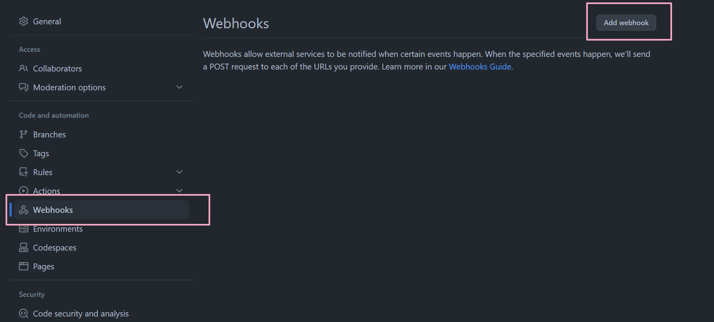

<div align="center">

# Go-GitHub-Webhooks

_✨ Webhooks Builder Written in Golang. ✨_	
<p>
<a href="./LICENSE">
    
</a>
<a href="https://go.dev">
	
</a>
</p>

<p>

</p>
</div>


## Installation

```sh
git clone https://github.com/MuelNova/go-github-webhooks.git
cd go-github-webhooks/src
go build
```

### Run as service

```sh
mkdir ~/.config/systemd/user -p
cp go-github-webhooks.example ~/.config/systemd/user/go-github-webhooks.service
```

Edit `~/.config/systemd/user/go-github-webhooks.service` to the config you want.

```sh
systemctl --user daemon-reload
systemctl --user start go-github-webhooks
```


## Configuration

```sh
cp .env.example .env
```

| Item          | Description                                       | Default Value | Type     |
| ------------- | ------------------------------------------------- | ------------- | -------- |
| GITHUB_SECRET | Webhook secret, see [below](#Usage)               | -             | Required |
| PORT          | Listening port                                    | 4567          | Optional |
| EXTRA_COMMAND | Command to be executed when receiving PUSH event. | -             | Optional |


## Usage

First, go the the repo you want to listen, click `settings`


Find `Webhooks`, then click `Add webhook`




The `Payload URL` should be your ip or your domain name and your port, we recommend you to use HTTPS instead of HTTP.

The `Secret` you set should be filled into `GITHUB_SECRET` as well.

> For safety consideration, the `Secret` is a must in the configuration.

